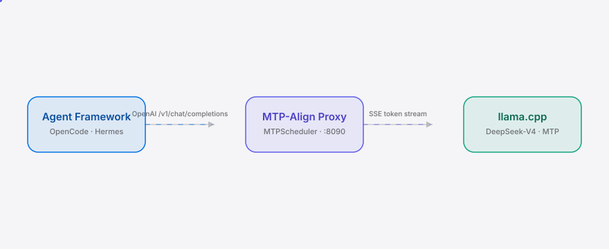

<div align="right"><sub><b>English</b>&nbsp;&nbsp;⇄&nbsp;&nbsp;<a href="./README.md">简体中文</a></sub></div>

<p align="center">
  <picture>
    <source media="(prefers-color-scheme: dark)" srcset="./assets/hero-dark.svg">
    <source media="(prefers-color-scheme: light)" srcset="./assets/hero-light.svg">
    
  </picture>
</p>

<p align="center"><sub>Batch agent tool calls to DeepSeek-V4's MTP decode windows and let local tps run full again.</sub></p>

<p align="center">
  <a href="./LICENSE"></a>
  <a href="https://github.com/SuperMarioYL/mtp-align/releases"></a>
  
  
  
  
</p>

> **DeepSeek-V4's MTP decodes multiple tokens per forward pass — but every agent tool call interrupts the stream and the MTP gain collapses to zero. MTP-Align batches tool calls to MTP decode-window boundaries so local tps runs full again.**

---

## Contents

- [Architecture](#architecture)
- [Why MTP-Align](#why-mtp-align)
- [Install](#install)
- [Quickstart](#quickstart)
- [Usage](#usage)
- [Demo](#demo)
- [Configuration](#configuration)
- [Pricing & commercial tier](#pricing--commercial-tier)
- [Roadmap](#roadmap)
- [License](#license)

<h2> Architecture</h2>

<p align="center">
  <picture>
    <source media="(prefers-color-scheme: dark)" srcset="./assets/atlas-dark.svg">
    <source media="(prefers-color-scheme: light)" srcset="./assets/atlas-light.svg">
    
  </picture>
</p>

Three components; we ship the middle one. No microservices, no containers, no Kubernetes — the proxy is a single ASGI process behind uvicorn.

- **Agent Framework** (OpenCode / Hermes) hits the proxy over the OpenAI-compatible `/v1/chat/completions`.
- **MTP-Align Proxy** (`:8090`) intercepts the streaming response, tracks the current MTP decode window with `MTPScheduler`, and buffers tool-call triggers until the window boundary before flushing.
- **llama.cpp server** (`:8080`) runs DeepSeek-V4 + MTP/DSpark and does the real decoding.

The core primitive is the **MTP decode window** — a scheduler-level model of DeepSeek-V4's multi-token-prediction batch: one forward pass emits `window_size` tokens (4 for DSV4). If the agent interrupts the stream mid-window to fire a tool call, the remaining tokens of that window are wasted. The scheduler tracks the window boundary and defers the tool-call flush to the boundary, letting the window run to completion. This is a DeepSeek-specific decode structure — GPT/Claude single-token streams have no window to align against.

## Why MTP-Align

DeepSeek-V4's MTP lets a single forward pass emit multiple tokens, **but only while the decode stream stays continuous**. Agent tool-call loops break that continuity: every tool invocation interrupts the stream mid-window, collapsing multi-token throughput back to single-token decode. Users running DSV4F 0731 + Hermes / OpenCode today get "workhorse" throughput but silently forfeit the MTP gain at every tool-call boundary, and no existing tool measures or recovers that loss. MTP-Align is that scheduler — aligning tool calls to decode-window boundaries and turning an unused model primitive into realized local speedup.

> ⚠️ Note: the central claim — that MTP gain is lost at tool calls — is **not yet measured**; current evidence is two r/LocalLLaMA threads. `mtp-align bench` exists to falsify it: the synthetic model shows a +9.2% delta (below), but the real kill-gate is `mtp-align bench --upstream <your llama.cpp>`. If delta < 5%, the project stops here.

<h2> Install</h2>

```bash
pip install mtp-align        # or: uv tool install mtp-align
```

Requires Python ≥ 3.12. The proxy needs `fastapi` / `uvicorn`, already in the deps.

<h2> Quickstart</h2>

Three commands from a cold clone to a visible result:

```bash
mtp-align bench                                   # synthetic benchmark, no GPU, ~1s
mtp-align serve --upstream http://localhost:8080  # start the MTP-aware proxy on :8090
OPENAI_BASE_URL=http://localhost:8090/v1 your-agent  # point your agent here
```

<details><summary>Synthetic benchmark output (sample)</summary>

```
       MTP-Align benchmark — naive vs. MTP-aligned decode       
┏━━━━━━━━━┳━━━━━━━━┳━━━━━━━━━━┳━━━━━━━┳━━━━━━━━━━━━━━┳━━━━━━━━━┓
┃ mode    ┃ tokens ┃ wall (s) ┃   tps ┃ continuity % ┃ delta % ┃
┡━━━━━━━━━╇━━━━━━━━╇━━━━━━━━━━╇━━━━━━━╇━━━━━━━━━━━━━━╇━━━━━━━━━┩
│ naive   │    512 │   11.344 │ 45.13 │         91.1 │       — │
│ aligned │    512 │   10.384 │ 49.31 │        100.0 │    +9.2 │
└─────────┴────────┴──────────┴───────┴──────────────┴─────────┘
✓ kill-gate PASSED: tps delta +9.2% (gate ≥ 5%)
```

> The above is a **synthetic model upper bound** (each tool call charged a full wasted window), not a GPU measurement. The real kill-gate is `mtp-align bench --upstream <url>`.
</details>

<h2> Usage</h2>

The five most common workflows:

```bash
# 1. Synthetic benchmark (CI / GPU-free, always runnable)
mtp-align bench

# 2. Real kill-gate: hit your running llama.cpp (DSV4 + MTP/DSpark on)
mtp-align bench --upstream http://localhost:8080 --tokens 512 --tool-calls 12

# 3. Start the MTP-aware proxy (m2 milestone)
mtp-align serve --upstream http://localhost:8080 --port 8090 --window 4

# 4. Route your agent through the proxy (one env var, no agent code change)
OPENAI_BASE_URL=http://localhost:8090/v1 opencode chat

# 5. Programmatic: see examples/benchmark.py
python examples/benchmark.py
```

All CLI options: `mtp-align --help`.

<h2> Demo</h2>


The 10-minute happy path: install → synthetic benchmark → read the tps delta. Re-render with `docs/demo.tape` (vhs).

<h2> Configuration</h2>

Key fields of `MTPConfig` (`mtp_align/config.py`):

| Field | Type | Default | Meaning |
|---|---|---|---|
| `upstream` | str | `http://localhost:8080` | Upstream llama.cpp base URL |
| `listen_port` | int | `8090` | Proxy listen port |
| `window_size` | int | `4` | Tokens per MTP forward pass (DSV4=4) |
| `flush_policy` | str | `window_boundary` | Flush policy: `window_boundary` or `eager` |
| `max_batch` | int | `8` | Batch cap that forces an early flush |
| `benchmark_tokens` | int | `512` | Total tokens in the benchmark workload |
| `benchmark_tool_calls` | int | `12` | Interleaved tool calls |
| `window_latency_s` | float | `0.08` | Synthetic: wall time of one forward pass (mock only) |
| `tool_overhead_s` | float | `0.012` | Synthetic: round-trip cost of one tool call (mock only) |

<h2> Pricing & commercial tier</h2>

The v0.1 proxy and benchmark are **fully open-source and free** (MIT). The commercial path targets **信创 / air-gapped inference clusters** running DeepSeek-V4 on owned GPUs where cloud APIs aren't an option — monetizing the tps thesis the OSS proxy proves into fleet telemetry and SLA.

**Commercial deliverables (on-prem deployable, Helm / systemd, air-gapped friendly):**

- Fleet-wide tps dashboards: cross-node aggregated window-continuity %
- Per-team / per-cluster continuity % and SLA boards
- tps-regression alerting (fire when continuity drops past threshold)
- Priority scheduler fixes and support

**Pricing (per cluster, not per seat):** ¥30k–80k / cluster / year, tiered by GPU count. Below ¥30k the on-prem sales overhead doesn't clear; above ¥80k the OSS proxy plus a two-day internal script undercuts. First 3 design-partner clusters get a launch discount.

**Smallest "yes" path:** ① run the free OSS proxy on one node, see the bench delta → ② 30-min remote demo: install the telemetry bundle on a 2-node cluster, watch the fleet dashboard aggregate continuity + an SLA alert fire → ③ design-partner agreement, ¥30k PO, 90-day SLA pilot. Billing via 企业微信 / bank transfer + fapiao flow, not Stripe.

Out of scope for v0.1: cloud hosting (the product exists because decode is local), multi-user auth, web UI. Those are v2.

<h2> Roadmap</h2>

- [x] **m1 — measure tps delta**: `mtp-align bench` runs end-to-end and prints a falsifiable delta table (kill-gate < 5% stops the project)
- [ ] **m2 — build the MTP proxy**: FastAPI proxy intercepts `/v1/chat/completions`, tracks the MTP window, flushes tool calls at boundaries; point OpenCode at the proxy and see real tps improve
- [ ] **m3 — integrate & launch**: OpenCode/Hermes integration, 60s before/after-tps demo, bilingual README, ship to r/LocalLLaMA + Show HN
- [ ] Future: non-DeepSeek MTP models (Qwen-MTP / Kimi-MTP); fleet-telemetry commercial tier

<h2> License</h2>

MIT — see [LICENSE](./LICENSE). File bugs in [Issues](https://github.com/SuperMarioYL/mtp-align/issues) or suggestions in [Discussions](https://github.com/SuperMarioYL/mtp-align/discussions). PRs welcome if you want to propose MTP-Align as a backend option for your agent.

<p align="center"><sub><a href="./LICENSE">MIT</a> © 2026 SuperMarioYL</sub></p>
