[English](./README.en.md) · [Website](https://mtp-align.lei6393.com) · [GitHub](https://github.com/SuperMarioYL/mtp-align)

<picture>
  <source media="(max-width: 600px) and (prefers-color-scheme: dark)" srcset="./assets/presentation/hero-mobile-dark.svg">
  <source media="(max-width: 600px)" srcset="./assets/presentation/hero-mobile-light.svg">
  <source media="(prefers-color-scheme: dark)" srcset="./assets/presentation/hero-dark.svg">
  
</picture>

# mtp-align

**探索明确窗口边界上的工具调用缓冲。**

MTP-Align 提供小型调度状态机，排队工具调用，并在配置的 token 计数边界刷新。

## 为什么需要它

缓冲策略的状态与刷新决策明确后，才便于评估。项目将确定性机制与希望验证的推理性能假设分开。

- **明确状态变化** — 窗口进度与待处理调用可检查。
- **确定性实验** — 调度器可不依赖推理服务器运行。
- **可配置刷新策略** — 可以比较边界刷新与即时刷新行为。

## 架构

<picture>
  <source media="(max-width: 600px) and (prefers-color-scheme: dark)" srcset="./assets/presentation/architecture-mobile-dark.svg">
  <source media="(max-width: 600px)" srcset="./assets/presentation/architecture-mobile-light.svg">
  <source media="(prefers-color-scheme: dark)" srcset="./assets/presentation/architecture-dark.svg">
  
</picture>

MTPScheduler 维护配置窗口与待处理 ToolCallBatch；on_token 推进计数，返回 WAIT 或 FLUSH。代理将机制连接到流式 HTTP 链路，基准还可使用合成时间模型驱动它。

| 组件 | 职责 |
| --- | --- |
| `Token events` | Explicit scheduler input |
| `MTP window` | mtp_align/scheduler.py |
| `Queued tool batch` | Pending calls and horizon |
| `Flush decision` | WAIT or FLUSH |

## 安装与快速上手

使用仓库清单指定的运行时版本构建，并在仓库根目录运行示例。

```bash
git clone https://github.com/SuperMarioYL/mtp-align.git
cd mtp-align
uv venv .venv
uv pip install --python .venv/bin/python -e .
source .venv/bin/activate
```

排队一次 lookup 调用，并向窗口大小为四的调度器输入四个明确 token 事件。

```bash
.venv/bin/python examples/presentation-demo.py
```

## 实际运行示例

<picture>
  <source media="(max-width: 600px) and (prefers-color-scheme: dark)" srcset="./assets/presentation/process-mobile-dark.svg">
  <source media="(max-width: 600px)" srcset="./assets/presentation/process-mobile-light.svg">
  <source media="(prefers-color-scheme: dark)" srcset="./assets/presentation/process-dark.svg">
  
</picture>

The tool call remains buffered for three events and flushes on the fourth.

```text
token 0: wait
token 1: wait
token 2: wait
token 3: flush
flushed calls: ['lookup']
windows completed: 1
```

完整命令与输出保存在 [docs/demo-results.json](./docs/demo-results.json). 输入和复现代码均随仓提供。


保留已有录制供参考；上方文字示例给出当前可复现的操作。

## 用法

CLI 提供以下操作。示例之外的命令需要替换成你的文件路径或标识。

```bash
mtp-align bench
# Experimental proxy, with your own compatible upstream:
mtp-align serve --upstream http://localhost:8080 --port 8090 --window 4
```

## 配置

MTPConfig 定义 upstream、listen_port、window_size、flush_policy 与 max_batch。window_latency_s 和 tool_overhead_s 是合成模型假设；window_boundary 与 eager 可比较调度行为，但配置本身不证明服务器优化。

## 集成与职责分工

<picture>
  <source media="(max-width: 600px) and (prefers-color-scheme: dark)" srcset="./assets/presentation/integrations-mobile-dark.svg">
  <source media="(max-width: 600px)" srcset="./assets/presentation/integrations-mobile-light.svg">
  <source media="(prefers-color-scheme: dark)" srcset="./assets/presentation/integrations-dark.svg">
  
</picture>

以下路径已有源码实现。按任务选择输入，并把生成的结果与项目一起保存。

| 路径 | 已实现职责 |
| --- | --- |
| Python state machine | Direct scheduling API |
| SSE proxy scaffold | Chat-completions forwarding |
| Config | Window, batch and flush policy |
| Synthetic benchmark | Timing-model exploration |

## 限制与后续方向

- SSE 内容片段不一定对应一个模型 token，计数也不能确定真实 MTP 前向传播边界。
- 尚未建立 GPU 吞吐收益证据；合成基准使用假设时间与中断成本。
- 代理属于实验实现；请求隔离、工具调用分片拼装与生产背压需要进一步验证。

下一步需要把调度事件对应到实际服务器解码边界，并在真实负载测量端到端行为。

## 许可与贡献

许可见 [LICENSE](./LICENSE). 反馈问题时请提供最小输入、执行命令和实际输出。
